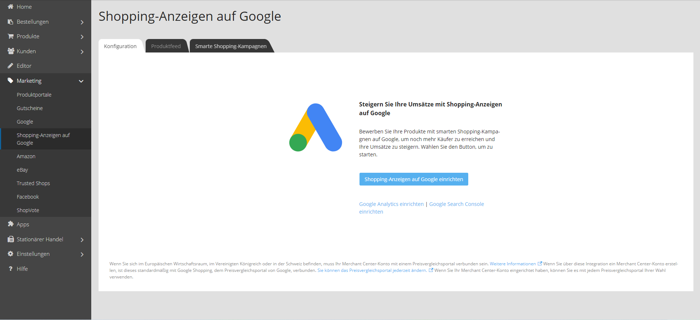
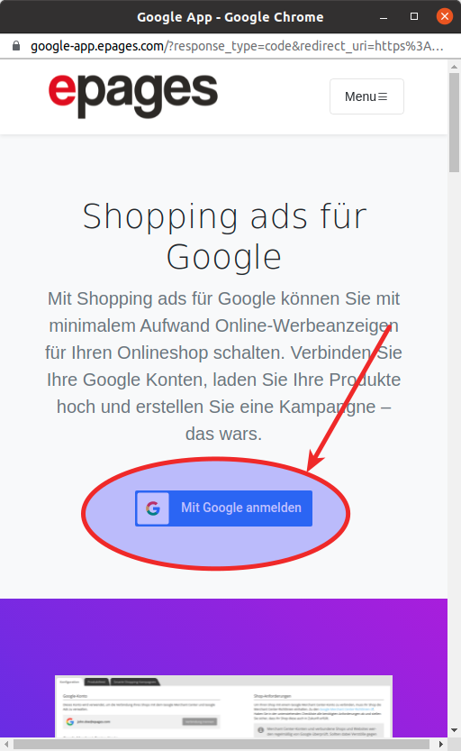

Starten Sie die Nutzung von Shopping-Anzeigen auf Google, indem Sie in der Shop Administration den Menüpunkt **"Marketing > Shopping-Anzeigen auf Google"** auswählen, und dann auf den "Shopping-Anzeigen auf Google einrichten" Button klicken.

Daraufhin öffnet sich ein Popup Dialog mit einer Webseite, auf der die Shopping-Anzeigen auf Google Anbindung erklärt wird. Klicken Sie auf die "Mit Google anmelden" Button, um mit der Einrichtung fortzufahren.

