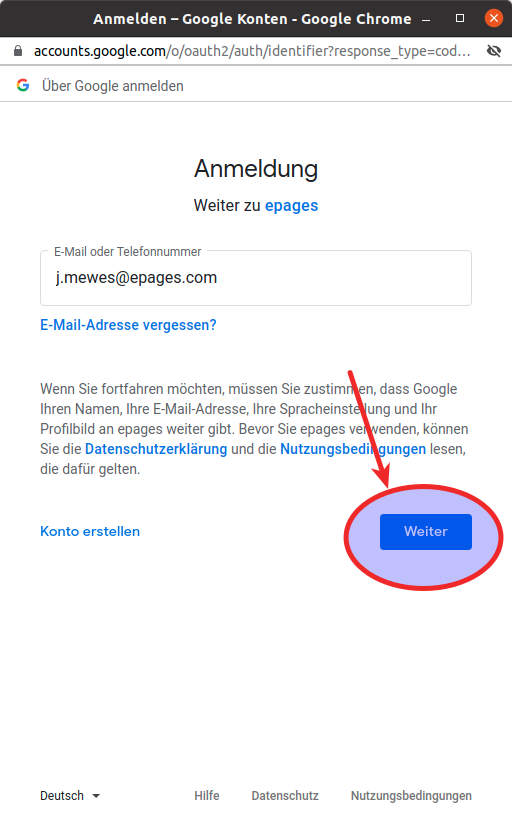
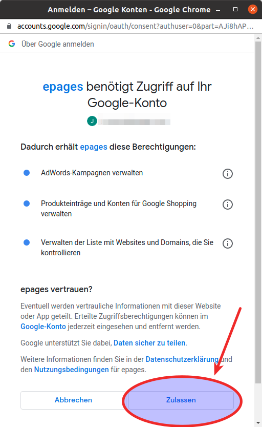

Füllen Sie die Formular-Felder für die Anmeldung bei Google aus und klicken Sie dann auf "Weiter".

Im letzen Schritt der Google Formulare, bestätigen Sie dass Ihr Onlineshop Zugriff auf Ihr Google Konto bekommt, in dem Sie die angeforderten Berechtigungen mit einem Klick auf den "Zulassen" Button bestätigen.

