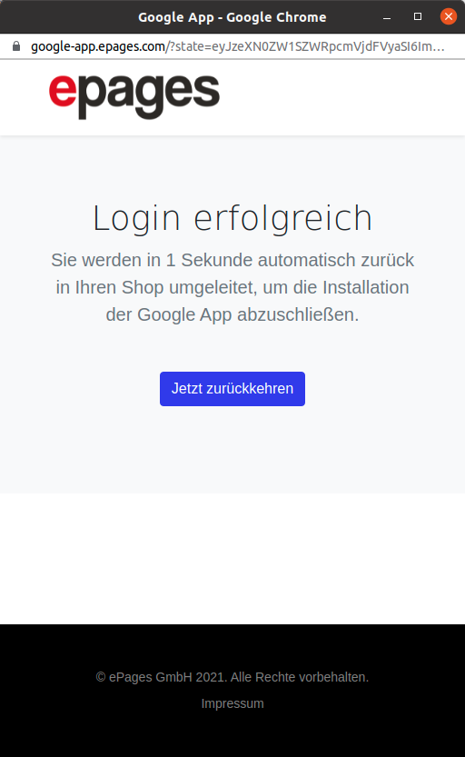
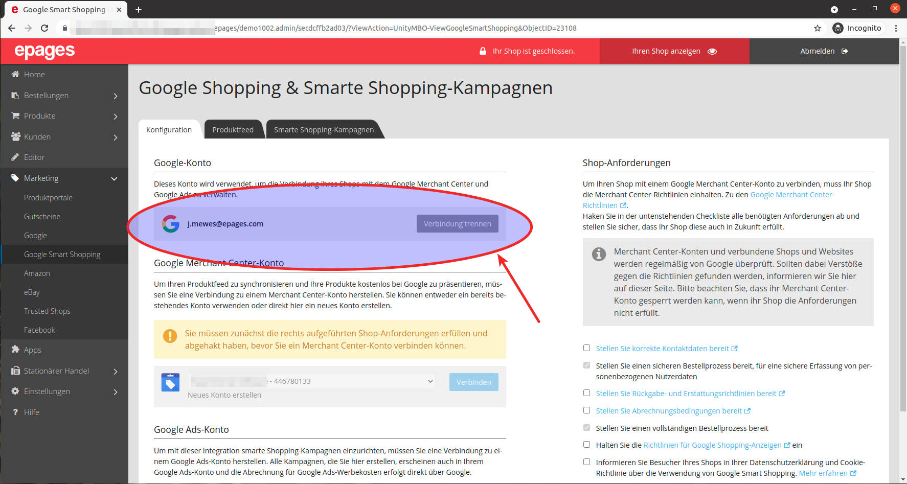

Nach der Bestätigung der Berechtigungen auf Ihr Google Konto werden Sie zurück auf die Webseite der Google Anbindung zurückgeführt. Hier sehen Sie eine Meldung, dass die Anmeldung erfolgreich war. Nach drei Sekunden werden Sie automatisch zurück in Ihren Shop umgeleitet.

In Ihrem Shop sehen Sie daraufhin in dem "Konfiguration" Tab, dass Ihr Google Konto verbunden ist.

Sie können nun mit der Einrichtung des Merchant Center Konto fortfahren.
