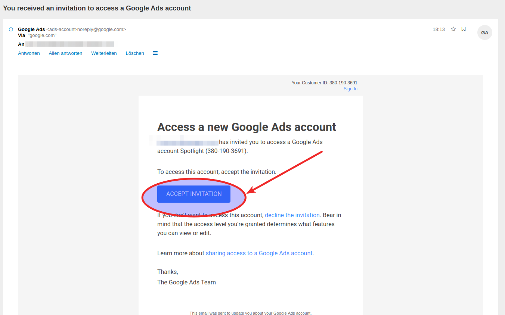
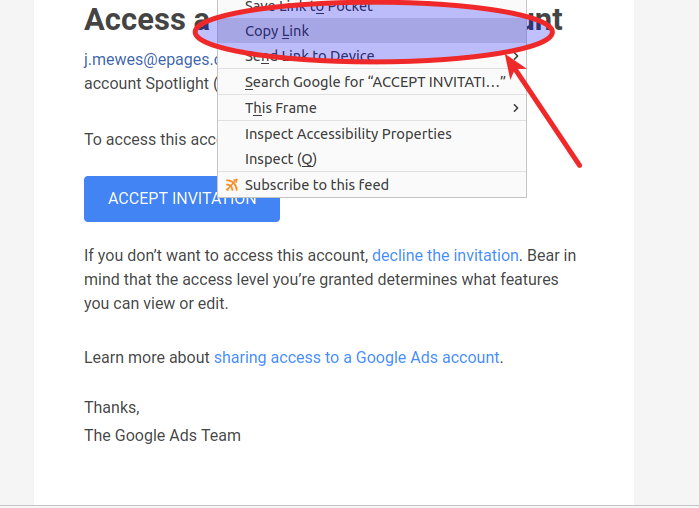
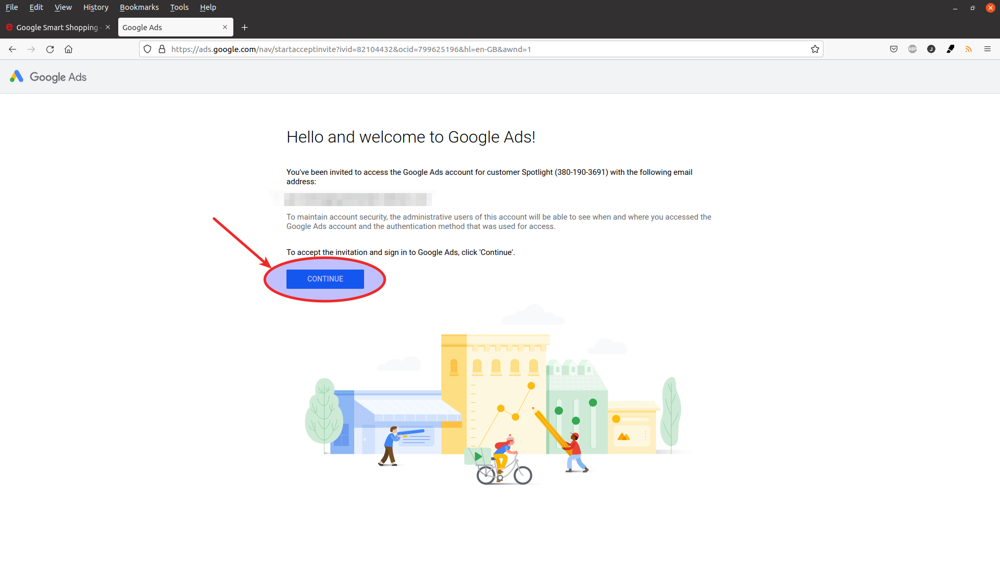

Nach dem Anlegen des Kontos erhalten Sie innerhalb von 1-5 Minuten eine Email von Google, mit einer Einladung zu diesem Account.


Falls Sich nach dem Klick auf den Link ein Tab öffnet und sofort wieder schließt, dann ist Ihr Browser nicht kompatibel mit dem Link in der von Google generierten Email (dies tritt häufig bei aktivierten Ad-Blockern auf). Machen Sie dann einen Rechtsklick auf dem Link-Button und kopieren Sie den Link in die Zwischenablage. Fügen Sie dann mit Ctrl + V (bzw. Cmd + V) den Link in die Addresszeile des Browsers ein.



Bestätigen Sie dann in auf der Google Webseite die Einladung zu Ihrem neuen Google Ads Konto.

