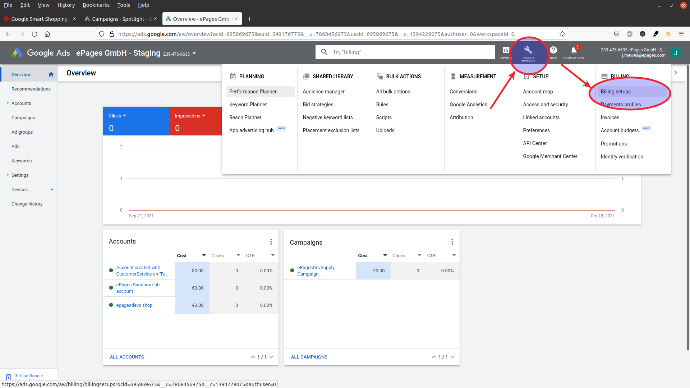
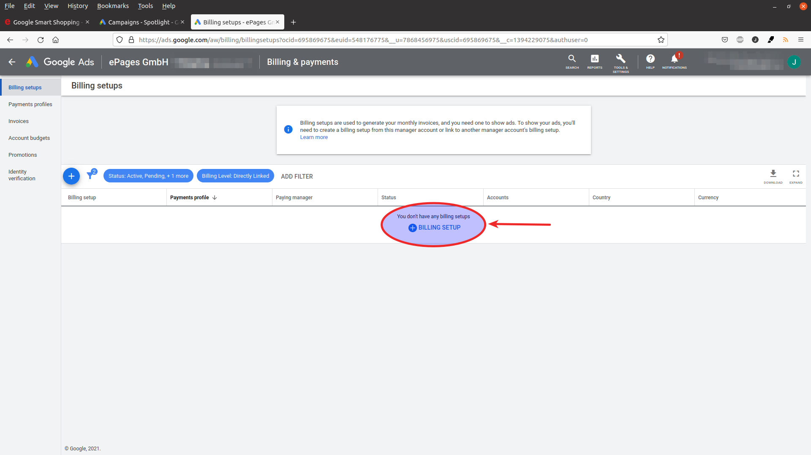

Das einzige was Sie manuell in Ihrem Google Ads Konto machen müssen ist das Anlegen der Rechnungsdaten.

Gehen Sie dazu in dem Werkzeugmenü auf "Billing setups".

Klicken Sie auf das Plus-Icon um Ihre Rechnungsdaten zu hinterlegen.

