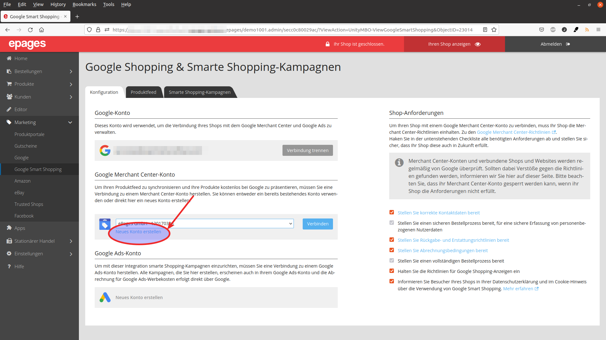
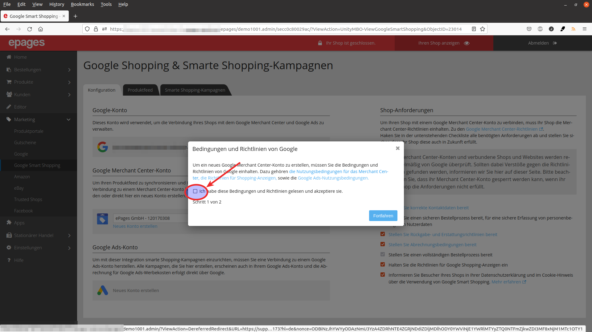
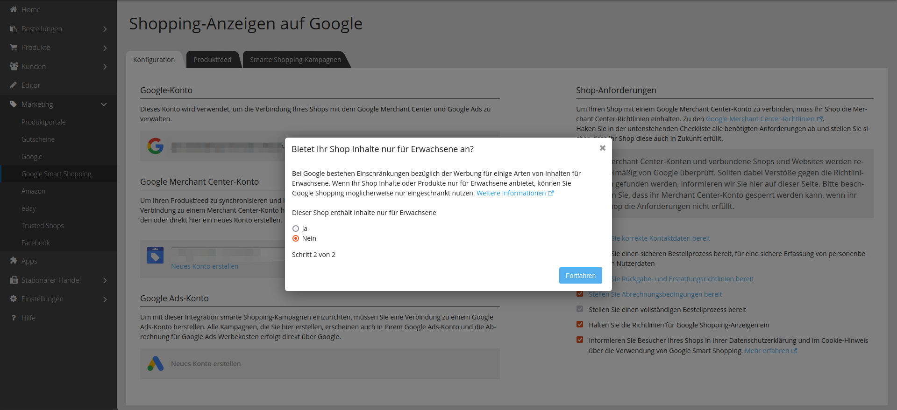

Klicken Sie auf den "Neues Konto erstellen" Link, um sich einen neuen Merchant Center Account anzulegen.

Darauf hin öffnet sich ein Konfigurationsassitent mit zwei Schritten.

Im ersten Schritt, bestätigen Sie Google's Nutzungsbedingungen.

Danach, informieren Sie Google ob in Ihrem Shop Produkte sind, die nur an Erwachsene verkäuft werden dürfen.

