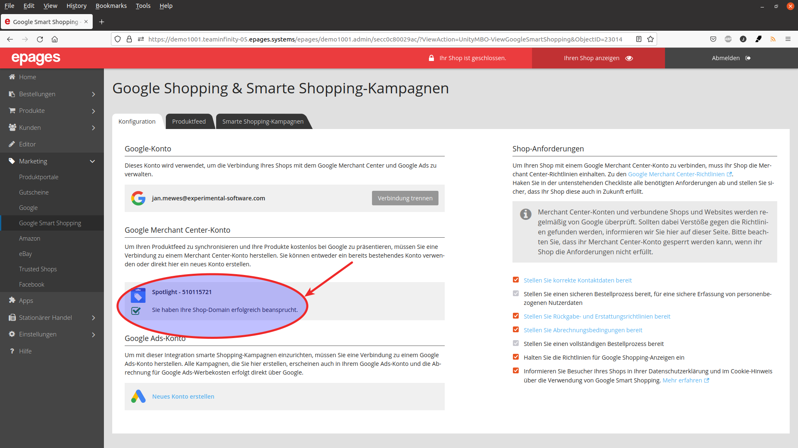
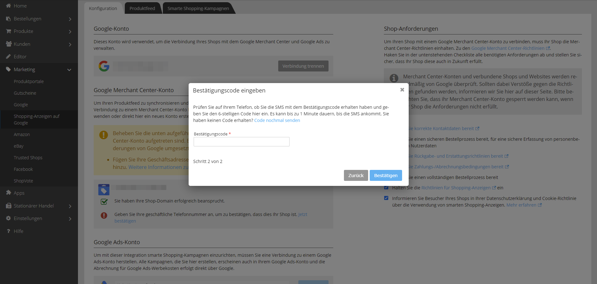
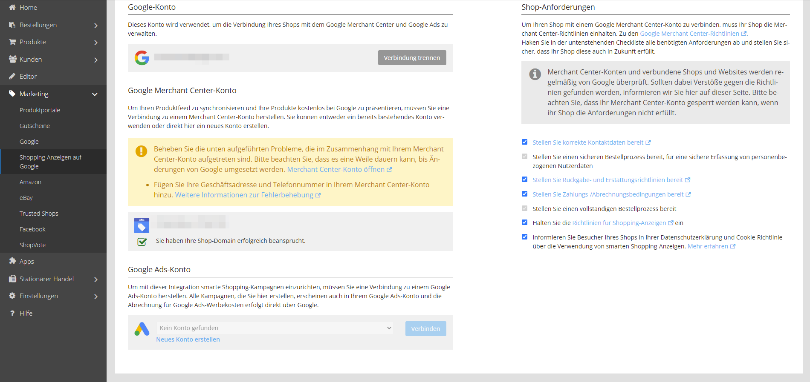

Um gegenüber von Google Shopping zu versichern, dass Sie der Besitzer Ihrer Shop von der Domain sind auf die Ihre Produktanzeigen verlinken werden, muss ein Verifizierungsprozess durchlaufen werden. Dies passiert automatisch im Hintergrund nach dem Anlegen Ihres Accounts.

Im nächsten Schritt muss zur Verfifzierung die Telefonnummer hinterlegt werden. 

An diese Telefonnummer wird ein Besätigunscode geschickt, der in der folgenden Maske eingegeben wird.

Wenn alle Schritte erfolgreich waren, erscheint folgende Meldung:


Falls es zu einem Fehler bei der Beanspruchung der Shop-Domain gekommen ist, wenden Sie sich bitte an den [Support](mailto:info@epages.com).


