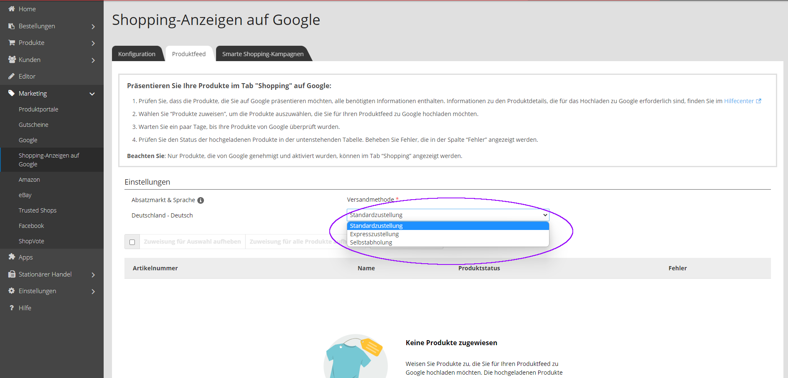
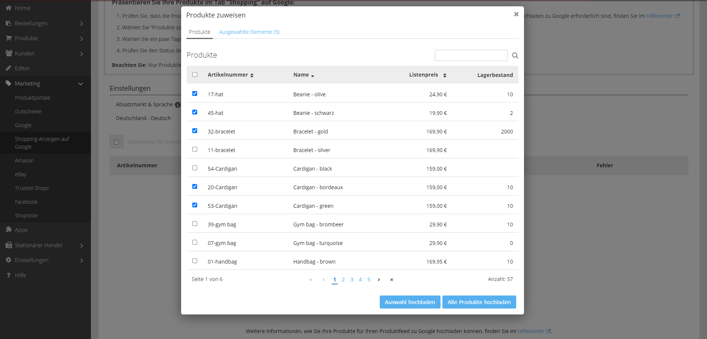

In Ihrem Administrationsbereich unter **Marketing > Shopping-Anzeigen auf Google** öffnen Sie den Produktfeed. 

## Einstellungen

Dort können nun Einstellungen wie Versandmethode und Sprache festgelegt werden.

Im letzten Schritt werden die Produkte ausgewählt, die beworben werden sollen, dabei können durch das Setzen von Haken nur ausgewählte Produkte hochgeladen werden oder durch Klick auf einen weiteren Button können alle Produkte hochgeladen werden.

Nun werden die ausgewählten Produkte im Merchant Center hochgeladen und können nach abschließender Prüfung von Google beworben werden.