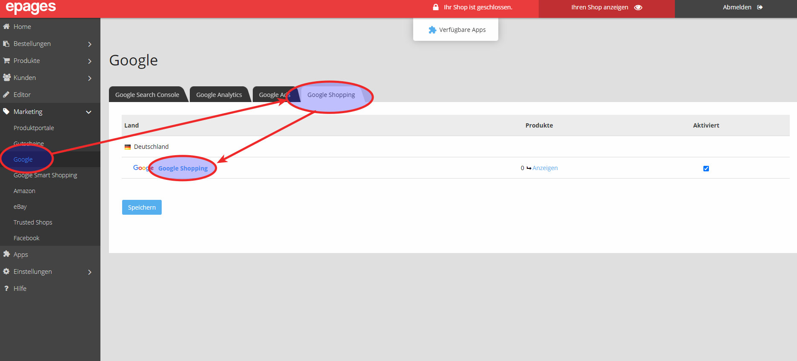
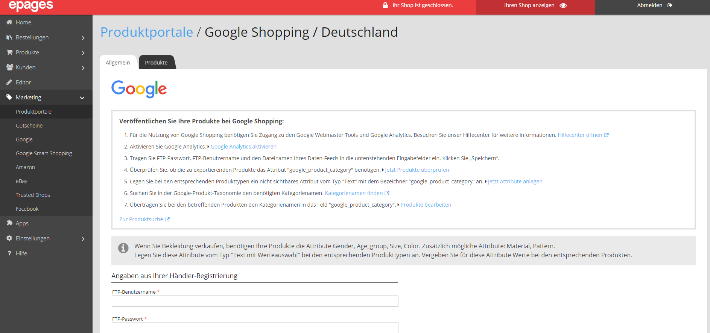

In einem weiteren Tab werden Ihre Shop-Einstellungen für die Kampagne geöffnet. Dafür gehen Sie in Ihrem Shop auf **Google** und klicken dort im Reiter **Google Shopping** auf den Link zu **Google Shopping**.

Dieser weitere Tab bleibt geöffnet. Hier werden im weiteren Verlauf die Daten für den Upload eingetragen.

