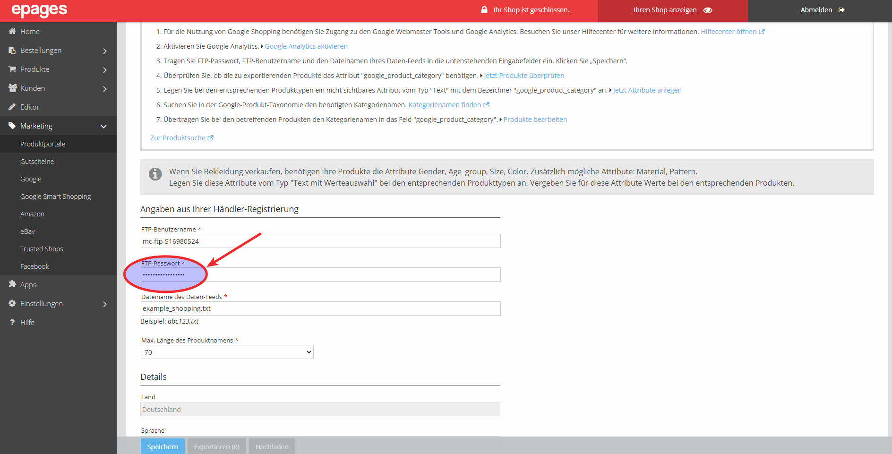


Um den FTP Zugriff zu konfigurieren, müssen Sie im Merchant Center ein FTP Konto anlegen und dann dessen Nutzername und Passwort in der Shop Administration eintragen.


# ☞ Google Merchant Center

## SFTP/FTP/GCS-Bereich

Wählen Sie **SFTP/FTP/GCS**.

## SFTP- & FTP-Einstellungen 

Daraufhin erscheinen die Einstellungen für die **SFTP** sowie **FTP Settings**. Dann den Pfeil bei **FTP settings** anklicken.

## Benutzername

Kopieren Sie Ihren Usernamen.

# ☞ Shop-Administration

## Benutzername einfügen

Fügen Sie Ihren Usernamen unter **Marketing > Produktportale > FTP-Benutzername** ein.

# ☞ Merchant Center

## Passwort generieren

Erstellen Sie ein neues Passwort unter **FTP settings > Generate**.

## Passwort kopieren

Kopieren Sie das neue Passwort.


**Hinweise**:
- Das Passwort wird Ihnen nicht erneut angezeigt.
- Nutzen Sie nicht das Passwort aus dieser Anleitung.


# ☞ Shop-Administration

## Passwort einfügen

Fügen Sie das neue Passwort unter **Marketing > Produktportale > FTP-Passwort** ein.

