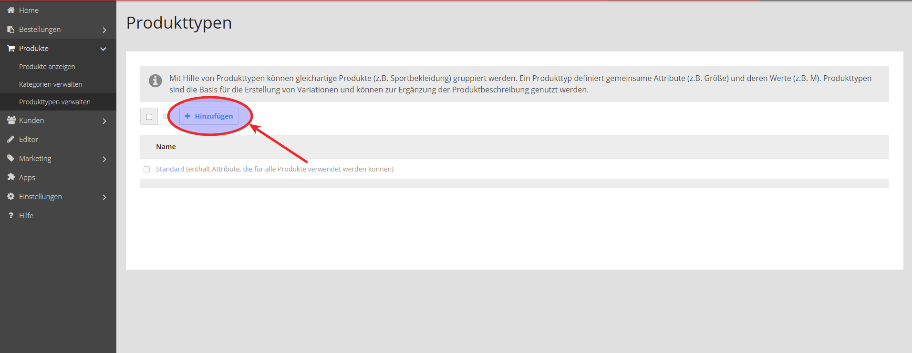

Unter dem Menüpunkt **Produkttypen verwalten** werden Produkttyp und Attribut angepasst, um Konfirmität für Google Shopping zu erlangen.
Dazu werden die Produkttypen über den **Hinzufügen** Button erstellt.

Die hier aufgezeigten Produkttypen und Attribute sind als Beispiel zu verstehen und **eventuell nicht passend für Ihren Shop**.


**Hinweis**: Die benötigten Attribute und Produkttypen finden Sie unter diesem Link: [support.google.com](https://support.google.com/merchants/answer/7052112?hl=de)


