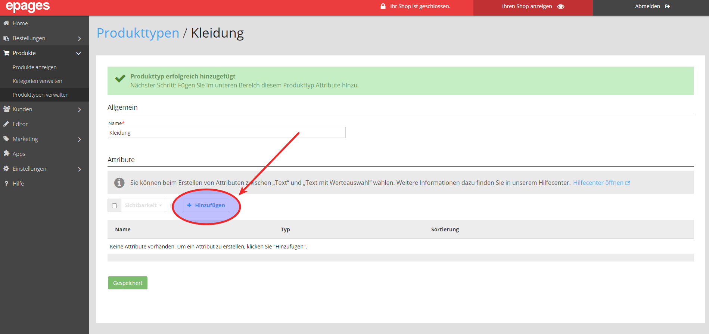
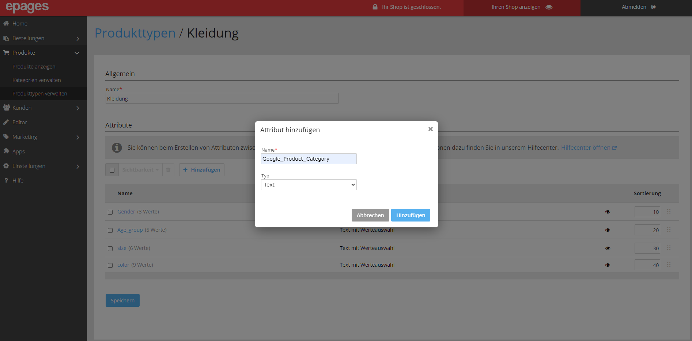
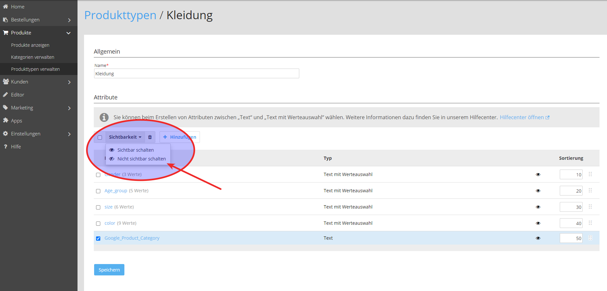
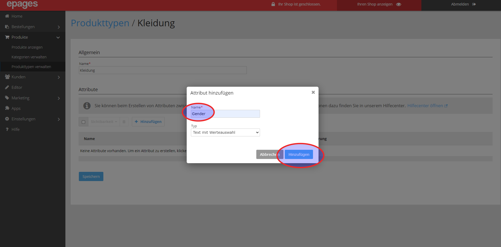
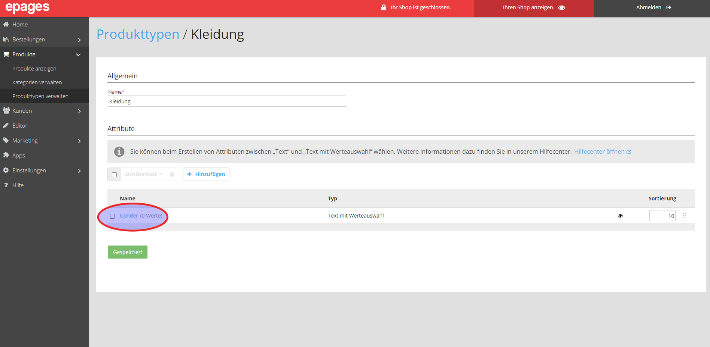
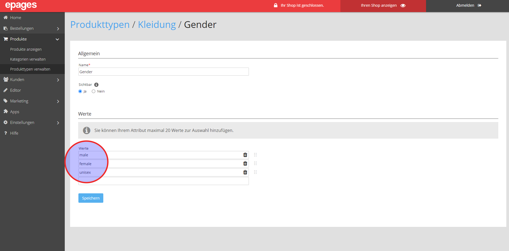
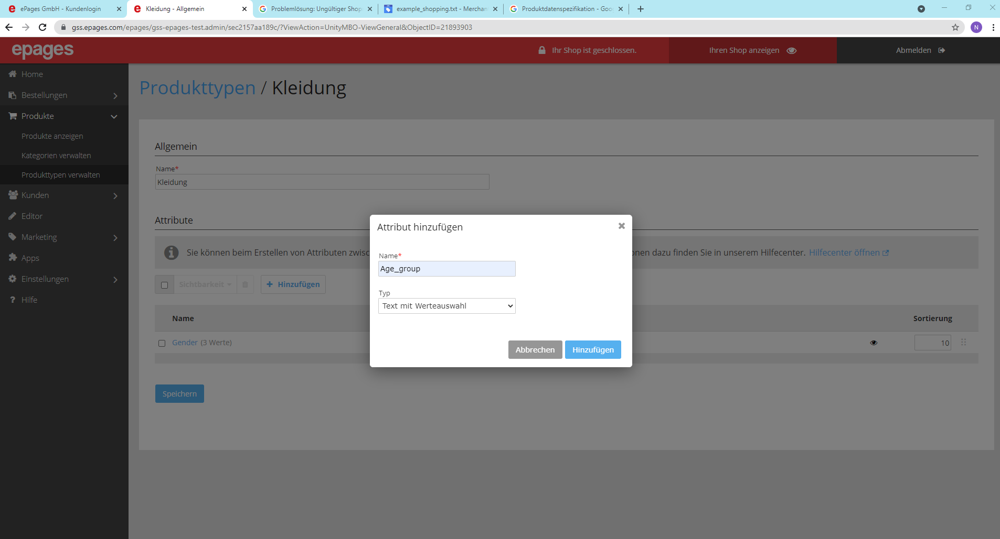
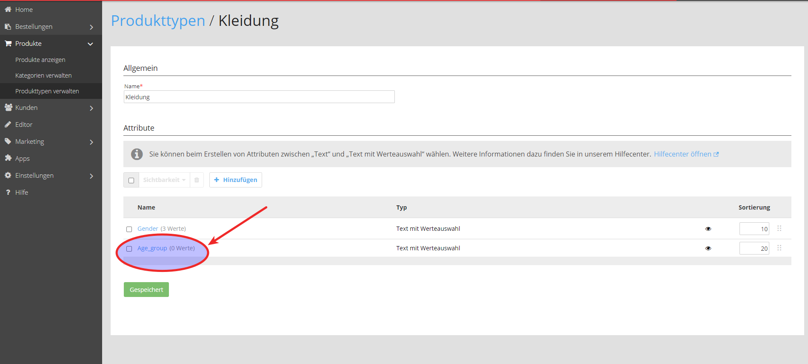
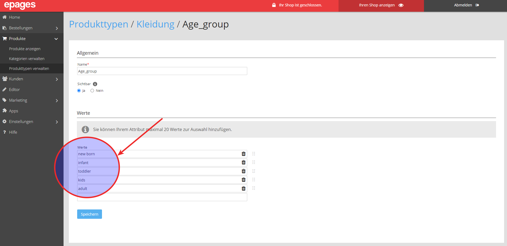
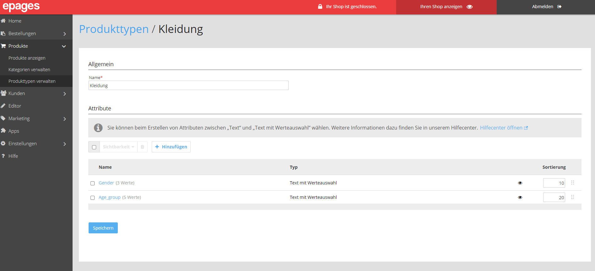


**Hinweis**: Die benötigten Attribute finden Sie unter diesem [Link](https://support.google.com/merchants/answer/7052112?hl=de).



**Hinweis**: Die Attribute müssen exakt mit den gezeigten, englischen Namen und Werten angelegt werden.


## Attribut für Kategorien anlegen

Als erste Attribut wird `Google_Product_Category` hinzugefügt.

## Sichbarkeit ändern

Sichtbarkeit auf **Nicht sichtbar** schalten.

## Attribut für Geschlecht anlegen

In diesem Fall „Gender“. Als Typ – Text mit Werteauswahl wählen und dann hinzufügen.

Dann direkt auf das Attribut klicken.

Die Werte zuweisen und speichern. Dies erspart Ihnen diese Werte bei den Produkten händisch einzutragen.

## Attribut für Altersgruppe anlegen

Weiteres Attribut „Age_group“.

Klicken auf das Attribut „Age_group“.

Attributwerte eintragen und dann speichern.

Erneut speichern.

