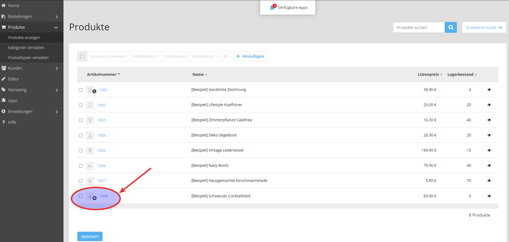
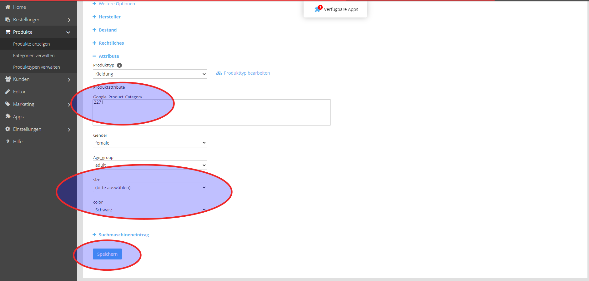
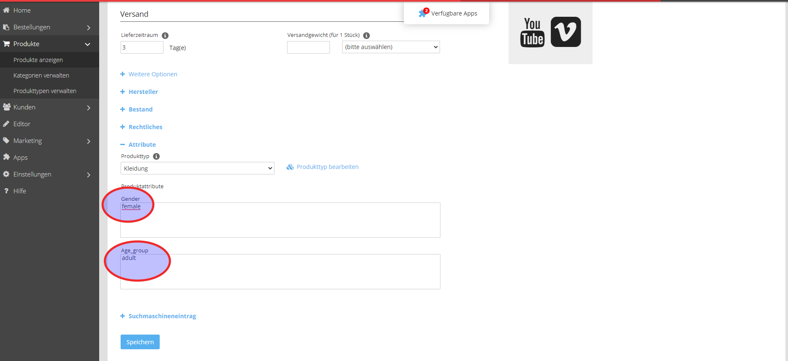

Falls Ihren Produkten noch keine Produkttypen zugeordnet wurden gehen Sie bitte folgendermaßen vor:

Im Reiter **Produkte anzeigen** auf die Artikelnummer klicken.

## Produkttyp auswählen

Dort unter Attribute den erstellten Produkttyp auswählen. Die Attribute, die für den Produkttyp voreingestellt wurden, auswählen.

Speichern.

**Hinweis**: Die Nummern für die Google-Product_Category finden sie unter diesem [Link](https://support.google.com/merchants/answer/6324436?hl=de#zippy=%2Cbekleidungsartikel).

## Werte zuweisen

Den Attributen dann Werte zuweisen und speichern.

