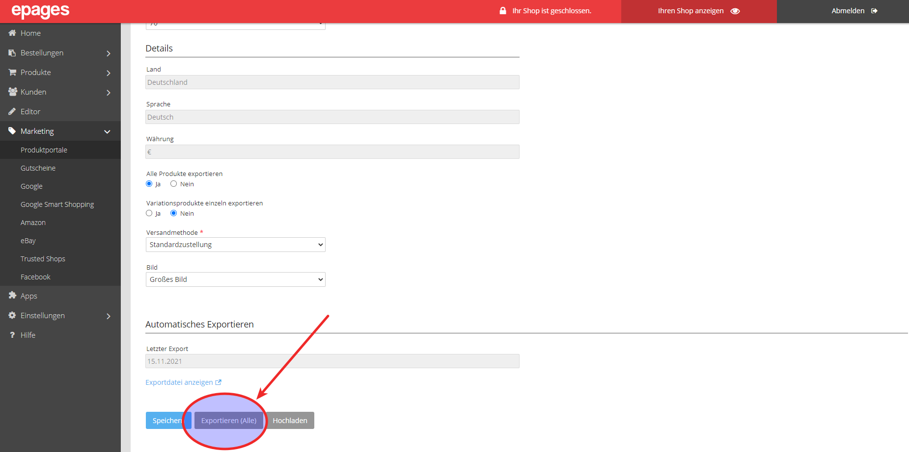

Jetzt im Produktportal erneut den Feed exportieren.


**Hinweis**: Nach dem initialen Upload werden Ihre Produkte regelmäßig automatisch synchronisiert. Jedoch können Sie manuell den Export starten, um schneller die Aktualisierungen im Google Merchant Center zu sehen.

