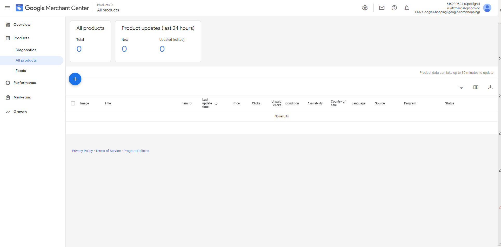

# ☞ Shop-Administration

## Zu den Details

Scrollen Sie unter **Marketing > Produktportale** zum Abschnitt „Details“.

## Produkte ins Merchant Center exportieren

Nehmen Sie folgende Einstellungen vor:

- Alle Produkte exportieren“: Ja
- „Variationsprodukte einzeln exportieren“: Nein 

Klicken Sie auf Speichern und dann auf Exportieren. Daraufhin startet der Upload Ihrer Produkte ins Google Merchant Center. 

## Exportierte Produkte prüfen

Nach erfolgtem Upload können Sie unter **Exportdatei anzeigen** prüfen, welche Produkte hochgeladen wurden.

## Ihre Exportdatei

So könnte Ihre Exportdatei aussehen:

## Mögliche Fehlermeldung

Nach dem Upload können Fehlermeldungen erscheinen, die auf fehlende Google-Produktkategorien hinweisen.

Prüfen Sie in diesem Fall die [Produkttypen und -attribute](https://kampagne-erstellen.de/produktmanagement/attribute-hinzufügen/).

# Merchant Center

## Zeitverzögerte Anzeige


**Hinweis**: Bis Sie Ihre Produkte im Merchant Center sehen, können 30 Minuten oder mehr vergehen.


