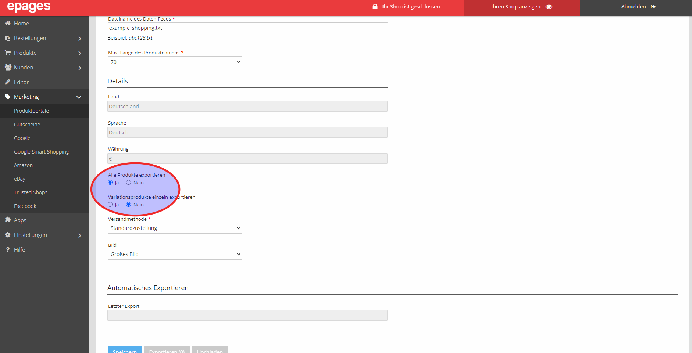

*Shop-Administration*:

Nehmen Sie folgende Einstellungen vor:

- Alle Produkte exportieren“: Ja
- „Variationsprodukte einzeln exportieren“: Nein 

Klicken Sie auf Speichern und dann auf Exportieren. Daraufhin startet der Upload Ihrer Produkte ins Google Merchant Center. 

